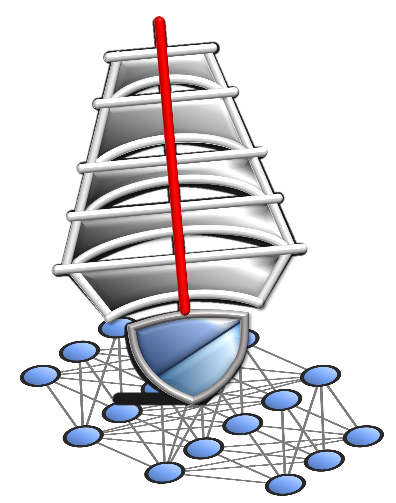
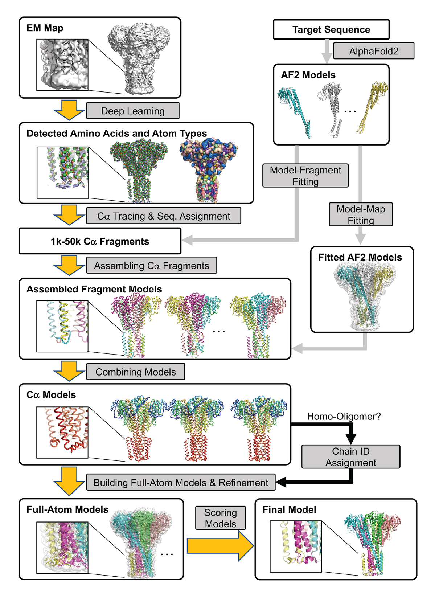

# DeepMainMast

<a href="https://github.com/marktext/marktext/releases/latest">
   
   
   
   
   
</a>  



DeepMainMast is a computational tool using deep learning to automatically build full protein complex structure from cryo-EM map.  

Copyright (C) 2022 Genki Terashi, Xiao Wang, Devashish Prasad, Tsukasa Nakamura, Daisuke Kihara, and Purdue University. 

License: GPL v3. (If you are interested in a different license, for example, for commercial use, please contact us.) 

Contact: Daisuke Kihara (dkihara@purdue.edu)

For technical problems or questions, please reach to Genki Terashi (gterashi@purdue.edu).

## Citation:

Genki Terashi, Xiao Wang, Devashish Prasad, Tsukasa Nakamura & Daisuke Kihara. DeepMainmast: integrated protocol of protein structure modeling for cryo-EM with deep learning and structure prediction. Nature Methods, 21: 122-131 (2024)
[Paper]()
```
@article{Terashi2024deepmainmast,
  title={DeepMainmast: integrated Protocol of Protein Structure Modeling for cryo-EM with Deep Learning and Structure Prediction},
  author={Genki Terashi, Xiao Wang, Devashish Prasad, Tsukasa Nakamura, and Daisuke Kihara},
  journal={Nature Methods},
  year={2023},
  volume={21},
  number={1},
  pages={122-131}
}
```

# Online Platform:

## Server(Recommended): https://em.kiharalab.org/algorithm/DeepMainMast
<details>
We have four publicly available platforms, which basically offer similar functionality.
Input: cryo-EM map+sequence file. Output: modeled protein structure. The input and output are the same across all platforms.
</details>

### Google Colab: https://colab.research.google.com/github/kiharalab/DeepMainMast/blob/main/DeepMainMast.ipynb
<details> 
   Step-by-step instructions are available. For free user, colab has 4-hour running time limit and may not work for large structures (>=1000 residues). Limited by redistribution constraints, only Ca tracing is available here
</details>

### Code Ocean: https://codeocean.com/capsule/0749800
<details> 
   Free online platform for easy usage. For academic users, CodeOcean has 10-hour running time limit per month. Limited by redistribution constraints, only Ca tracing is available here
</details>

### Local installation with source code at Github
<details>
Full code is available here and it is easier for user to modify to develop their own tools.
</details>

### Project website: https://kiharalab.org/emsuites
### Detailed pipeline instructions can be found https://kiharalab.org/emsuites/deepmainmast.php

## Introduction
<details>
   <summary>DeepMainMast is a computational tool using deep learning to automatically build full protein complex structure from cryo-EM map. </summary>
Structure modeling from maps is an indispensable step for studying proteins and their complexes with cryogenic electron microscopy (cryo-EM). Although the resolution of determined cryo-EM maps has generally improved, there are still many cases where tracing protein main-chains is difficult, even in maps determined at a near atomic resolution. Here, we have developed a protein structure modeling method, called DeepMainmast, which employs deep learning to capture the local map features of amino acids and atoms to assist main-chain tracing. Moreover, since Alphafold2 demonstrates high accuracy in protein structure prediction, we have integrated complementary strengths of de novo density tracing using deep learning with Alphafold2’s structure modeling to achieve even higher accuracy than each method alone. Additionally, the protocol is able to accurately assign chain identity to the structure models of homo-multimers.

</details>

## Overall Protocol 
<details>
(1) Detecting amino-acid types and atom types using deep learning (Emap2sf). The image on the left shows the detected atom types (Ca atom: green, carbon: orange, and nitrogen: light blue). The image on the right shows the detected amino acid types in different colors. <br>
(2) Tracing Ca path and assigning the target sequence using the Vehicle Routing Problem Solver and the Dynamic Programming algorithm. Different parameter combinations are used. <br>
(3) Assembling Ca fragments using the Constraint Problem (CP) Solver. Colors indicate chain IDs. <br>
(4) Combining Ca models built under different parameter combinations using the CP Solver. Colors indicate the direction of chains from blue to red for the N-terminal to the C-terminal residues. <br>
(5) Full-atom building and refinement using PULCHRA and Rosetta-CM. <br>
(6) Scoring generated full-atom models based on the DAQ(AA) score and the DOT score.<br>
 
<p align="center">
  
</p>
</details>

## Installation
<details>

### System Requirements
CPU: >=8 cores <br>
Memory (RAM): >=50Gb. For maps with more than 3,000 residues, memory space should be higher than 200GB. <br>
GPU: any GPU supports CUDA with at least 12GB memory. <br>
GPU is required for DeepMainMast and no CPU version is available for DeepMainMast since it is too slow.

## Installation Instructions
### 1. [`Install git`](https://git-scm.com/book/en/v2/Getting-Started-Installing-Git) 
### 2. Clone the repository in your computer 
```
git clone  https://github.com/kiharalab/DeepMainMast.git && cd DeepMainMast
```

### 3. Build dependencies.   
You have two options to install dependency on your computer:
#### 3.2 Install with anaconda (Recommended)
##### 3.2.1 [`install anaconda`](https://www.anaconda.com/download). 
##### 3.2.2 Install dependency in the command line
Make sure you are in the DeepMainMast directory and then run 
```
conda env create -f environment.yml
```
Each time when you want to run this software, simply activate the environment by
```
conda activate deepmainmast
conda deactivate(when you want to exit) 
```

### 4. Compile C packages
Run the following command:
```
bash make_c_programs.sh
```

### 5. Install Rosetta (optional)
If you want to build full-atom protein structure, then you need to install rosetta for DeepMainMast.
Please check the instructions [here](https://new.rosettacommons.org/demos/latest/tutorials/install_build/install_build) to install Rosetta locally. 


</details>

# Usage
<details> 
<summary>Protein complex structure modeling without AlphaFold (DeepMainMast-base)</summary>

## DeepMainMast(base)

```commandline
./dmm_full_multithreads.sh -p [program_path] -m [map_path] -f [fasta_path]  -c [contour] -o [output_path] -t [path_training_time] -T [fragment_assembling_time] -C [num_cpu] -M [num_cpu] -x [ROSETTA_PROGRAM_PATH]
```
[program_path] is the path of DeepMainmast program folder, absolute path suggested. <br>
[map_path]  is the path of the experimental cryo-EM map.<br>
[fasta_path] is the path of the input fasta file about sequence information. <br>
[contour] specifies the contour level as a density threshold to remove outside regions to save processing time. <br>
[output_path] specifies the output directory of DeepMainMast modeled structure. Final modeled structure DeepMainmast.pdb will be saved here. If the directory already exists, the final output will be DeepMainmast[random_digit].pdb to avoid overwritting.<br>
[path_training_time] specifies the computational Time Limit for PATH tracing per thread, default: 600 seconds. Suggested time: [total_num_residues]. <br>
[fragment_assembling_time] specifies the computational Time Limit for Fragment assembly, default: 600 seconds. Suggested time: [total_num_residues]. <br>
[num_cpu] Number of CPUs used for structure modeling processes. Minimum: 8. The more is better to accelerate the process.<br>
[ROSETTA_PROGRAM_PATH] specifies the rosetta program path, please make sure it is the directory that includes "main" directory after rosetta installment. It is optional, if you do not use this parameter, then DeepMainMast will only build Calpha only structures. It is required if you want to build full-atom protein structure.<br>
<b> Please include -H in command line if you have any two or more chains are identical. </b> That is important of correct chain assignment for identical chains.
<br> You can also add ```-F``` argument to accelerate the backbone tracing and sequence assignment steps, but may reduce the quality of final structure.
<br> If you are running on multi-GPU machines, please see FAQ to configure GPU correctly before running.

</details> 

<details> 
<summary>Protein complex structure modeling with AlphaFold (DeepMainMast)</summary>

# DeepMainMast
```commandline
./dmm_full_multithreads.sh -p [program_path] -m [map_path] -f [fasta_path] -A [alphafold_pdb_path] -c [contour] -o [output_path] -t [path_training_time] -T [fragment_assembling_time] -C [num_cpu] -M [num_cpu]  -x [ROSETTA_PROGRAM_PATH]
```
[program_path] is the path of DeepMainmast program folder, absolute path suggested. <br>
[map_path]  is the path of the experimental cryo-EM map.<br>
[fasta_path] is the path of the input fasta file about sequence information. <br>
[alphafold_pdb_path] is the path of the alphafold modeled structure in pdb format. Please combine all single-chain structures in one PDB file, separated by "TER" for different chains' records. The chain ID does not matter, for identical chains, you only need to provide the chain records once in the pdb format. <br>
[contour] specifies the contour level as a density threshold to remove outside regions to save processing time. <br>
[output_path] specifies the output directory of DeepMainMast modeled structure. Final modeled structure DeepMainmast.pdb will be saved here. If the directory already exists, the final output will be DeepMainmast[random_digit].pdb to avoid overwritting.<br>
[path_training_time] specifies the computational Time Limit for PATH tracing per thread, default: 600 seconds. Suggested time: [total_num_residues]. <br>
[fragment_assembling_time] specifies the computational Time Limit for Fragment assembly, default: 600 seconds. Suggested time: [total_num_residues]. <br>
[num_cpu] Number of CPUs used for structure modeling processes. Minimum: 8. The more is better to accelerate the process.<br>
[ROSETTA_PROGRAM_PATH] specifies the rosetta program path, please make sure it is the directory that includes "main" directory after rosetta installment. It is optional, if you do not use this parameter, then DeepMainMast will only build Calpha only structures. It is required if you want to build full-atom protein structure.<br>
<b> Please include -H in command line if you have any two or more chains are identical. </b> That is important of correct chain assignment for identical chains.
<br> You can also add ```-F``` argument to accelerate the backbone tracing and sequence assignment steps, but may reduce the quality of final structure.
<br> If you are running on multi-GPU machines, please see FAQ to configure GPU correctly before running.

</details>

<details> 
<summary>Example: single-chain structure modeling (3j9sA)</summary>

### Example: single-chain structure modeling (3j9sA)
Please run the following command in DeepMainMast program folder. <br> 
Examples are kept in [data/3j9sA](data/3j9sA) directory. 
#### Example Input
+ Target sequence file (-f): 3j9sA.fasta
+ MAP file (-m): 3j9sA.mrc
+ AlphaFold2 Model (optional -A): 3j9sA_af2.pdb
#### Calpha PATH tracing without AlphaFold2 Model
```
./dmm_full_multithreads.sh -p ./ -c 0.01 -o output_3j9sA -t 600 -T 600 -C 8 -M 8 -m ./data/3j9sA/3j9sA.mrc -f ./data/3j9sA/3j9sA.fasta
```
The outputs will be generated in [output_3j9sA/results] directory. The expected output structure is [output_3j9sA/DeepMainmast.pdb].

#### Calpha PATH tracing using AlphaFold2 Model
```
./dmm_full_multithreads.sh -p ./ -c 0.01 -o output_3j9sa -t 600 -T 600 -C 8 -M 8 -m ./data/3j9sA/3j9sA.mrc -f ./data/3j9sA/3j9sA.fasta -A ./data/3j9sA/3j9sA_af2.pdb
```
The outputs will be generated in [output_3j9sA/results] directory. The expected output structure is [output_3j9sA/DeepMainmast.pdb].

#### DeepMainMast: Protein full-atom structure modeling using AlphaFold2 Model
```
./dmm_full_multithreads.sh -p ./ -c 0.01 -o output_3j9sa -t 600 -T 600 -C 8 -M 8 -m ./data/3j9sA/3j9sA.mrc -f ./data/3j9sA/3j9sA.fasta -A ./data/3j9sA/3j9sA_af2.pdb -x [ROSETTA PROGRAM PATH]
```
Please confirm you install rosetta well, then please change -x to the rosetta program directory that includes "main" directory. <br>
The outputs will be generated in [output_3j9sA/results] directory. The expected output structure is [output_3j9sA/DeepMainmast.pdb].

#### Example Output
The example output is kept [here](https://kiharalab.org/emsuites/deepmainmast_example/3j9sA/) for your reference. All intermediate outputs are also kept here.

</details>


<details> 
<summary>Example: multi-chain structure modeling (EMD-1461, HomoOligomer)</summary>

### Example: multi-chain structure modeling (EMD-1461, HomoOligomer)
Please run the following command in DeepMainMast program folder. <br> 
Examples are kept in [data/1461](data/1461) directory.

#### Example Input
+ Target sequence file (-f): emd_1461.fasta
+ MAP file (-m): emd_1461.mrc
+ AlphaFold2 Model (optional -A): emd_1461_af2.pdb


#### Calpha PATH tracing without AlphaFold2 Model
```
./dmm_full_multithreads.sh -p ./ -c 0.3 -o output_1461 -t 1200 -T 600 -C 8 -M 8 -m ./data/1461/emd_1461.mrc -f ./data/1461/emd_1461.fasta  -H 
```
Since homo-oligomer includes identical chains, -H argument is required in the command line. <br>
The outputs will be generated in [output_1461/results] directory. The expected output structure is [output_1461/DeepMainmast.pdb].

#### Calpha PATH tracing using AlphaFold2 Model
```
./dmm_full_multithreads.sh -p ./ -c 0.3 -o output_1461 -t 1200 -T 600 -C 8 -M 8 -m ./data/1461/emd_1461.mrc -f ./data/1461/emd_1461.fasta  -H -A ./data/1461/emd_1461_af2.pdb 
```
Since homo-oligomer includes identical chains, -H argument is required in the command line. <br>
The outputs will be generated in [output_1461/results] directory. The expected output structure is [output_1461/DeepMainmast.pdb].


#### DeepMainMast: Protein full-atom structure modeling using AlphaFold2 Model
```
./dmm_full_multithreads.sh -p ./ -c 0.3 -o output_1461 -t 1200 -T 600 -C 8 -M 8 -m ./data/1461/emd_1461.mrc -f ./data/1461/emd_1461.fasta  -H -A ./data/1461/emd_1461_af2.pdb -x [ROSETTA PROGRAM PATH]
```
Since homo-oligomer includes identical chains, -H argument is required in the command line. <br>
The outputs will be generated in [output_1461/results] directory. The expected output structure is [output_1461/DeepMainmast.pdb].

#### Example Output 
The example output is kept [here](https://kiharalab.org/emsuites/deepmainmast_example/1461/) for your reference. All intermediate outputs are also kept here.

</details>

<details> 
<summary>Example: multi-chain structure modeling (EMD-2513, HeteroOligomer)</summary>


### Example: multi-chain structure modeling (EMD-2513, HeteroOligomer)
Please run the following command in DeepMainMast program folder. <br> 
Examples are kept in [data/2513](data/2513) directory.

#### Input Example
+ Target sequence file (-f): emd_2513.fasta
+ MAP file (-m): emd_2513.mrc
+ AlphaFold2 Model (optional -A): emd_2513_af2.pdb

#### Calpha PATH tracing without AlphaFold2 Model
```
./dmm_full_multithreads.sh -p ./ -c 0.01 -o output_2513 -t 1200 -T 1200 -C 8 -M 8 -m ./data/2513/emd_2513.mrc -f ./data/2513/emd_2513.fasta
```
The outputs will be generated in [output_2513/results] directory. The expected output structure is [output_2513/DeepMainmast.pdb].<br>
This example does not include any identical chains, so we should not add -H in command line. <b>For other examples that may include identical chains in the complex, please do not forget to add -H in command line.</b>

#### Calpha PATH tracing using AlphaFold2 Model
```
./dmm_full_multithreads.sh -p ./ -c 0.01 -o output_2513 -t 1200 -T 1200 -C 8 -M 8 -m ./data/2513/emd_2513.mrc -f ./data/2513/emd_2513.fasta  -A ./data/2513/emd_2513_af2.pdb 
```
The outputs will be generated in [output_2513/results] directory. The expected output structure is [output_2513/DeepMainmast.pdb].<br>
This example does not include any identical chains, so we should not add -H in command line. <b>For other examples that may include identical chains in the complex, please do not forget to add -H in command line.</b>


#### DeepMainMast: Protein full-atom structure modeling using AlphaFold2 Model
```
./dmm_full_multithreads.sh -p ./ -c 0.01 -o output_2513 -t 1200 -T 1200 -C 8 -M 8 -m ./data/2513/emd_2513.mrc -f ./data/2513/emd_2513.fasta  -A ./data/2513/emd_2513_af2.pdb -x [ROSETTA PROGRAM PATH]
```
The outputs will be generated in [output_2513/results] directory. The expected output structure is [output_2513/DeepMainmast.pdb].<br>
This example does not include any identical chains, so we should not add -H in command line. <b>For other examples that may include identical chains in the complex, please do not forget to add -H in command line.</b>

#### Example Output

The example output is kept [here](https://kiharalab.org/emsuites/deepmainmast_example/2513/) for your reference. All intermediate outputs are also kept here.

</details>

## FAQ
<details>
<summary>Q: How to configure the GPU correctly for DeepMainMast to run?</summary>

Please run the following command line before you run DeepMainMast in multi-GPU machines.
```
export CUDA_VISIBLE_DEVICES=[gpu_id]
```
Here the gpu_id should be the GPU ID that you want to use.

</details>

<details>
<summary>Q: How to interpret different models in DeepMainmast.pdb?</summary>

The 3D model is colored by [DAQ(AA) score](https://www.nature.com/articles/s41592-022-01574-4) scaled from red (-1.0) to blue (1.0) with a 19 residues sliding window.  
The 3D model contains four models (with rosetta)/ two models (without rosetta).  
In MODEL1, Ca-only structure, all modeled positions are colored by DAQ(AA) score.  
In MODEL2, Ca-only structure, amino acids with DAQ(CA) score below -0.5 are excluded, and amino acids with DAQ(AA) score below -0.5 are replaced with UNK.  
In MODEL3, full-atomic structure, all modeled positions are colored by DAQ(AA) score.  
In MODEL4, full-atomic structure, amino acids with DAQ(CA) score below -0.5 are excluded, and amino acids with DAQ(AA) score below -0.5 are replaced with UNK.  
</details>
